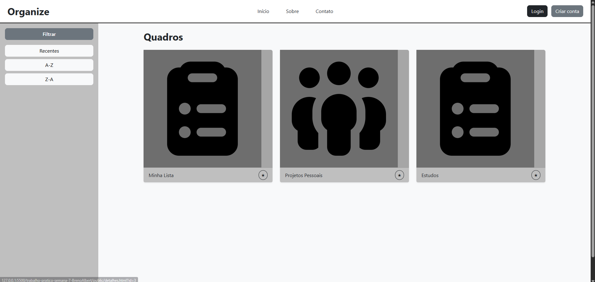
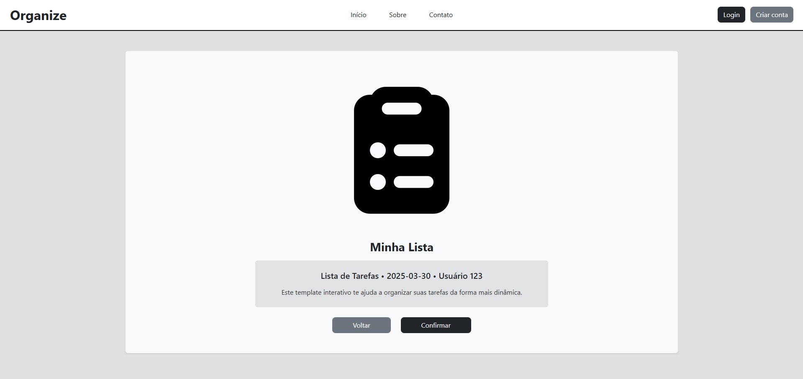

[](https://classroom.github.com/online_ide?assignment_repo_id=20650140&assignment_repo_type=AssignmentRepo)
# Trabalho Prático 05 - Semanas 7 e 8

**Páginas de detalhes dinâmicas**

Nessa etapa, vamos evoluir o trabalho anterior, acrescentando a página de detalhes, conforme o  projeto escolhido. Imagine que a página principal (home-page) mostre um visão dos vários itens que existem no seu site. Ao clicar em um item, você é direcionado pra a página de detalhes. A página de detalhe vai mostrar todas as informações sobre o item do seu projeto. seja esse item uma notícia, filme, receita, lugar turístico ou evento.

Leia o enunciado completo no Canvas. 

**IMPORTANTE:** Assim como informado anteriormente, capriche na etapa pois você vai precisar dessa parte para as próximas semanas. 

**IMPORTANTE:** Você deve trabalhar e alterar apenas arquivos dentro da pasta **`public`,** mantendo os arquivos **`index.html`**, **`styles.css`** e **`app.js`** com estes nomes, conforme enunciado. Deixe todos os demais arquivos e pastas desse repositório inalterados. **PRESTE MUITA ATENÇÃO NISSO.**

## Informações Gerais

- Nome: Breno Albert Batista de Sá
- Matricula: 902305
- Proposta de projeto escolhida: 3. Organização e equipes
- Breve descrição sobre seu projeto: Um site com a proposta de ser uma ferramenta para organização de cronogramas e agendas voltado para pessoas, grupos e organizações.

## Print da Home-Page



## Print da página de detalhes do item



## Cole aqui abaixo a estrutura JSON utilizada no app.js

```javascript
const dados = [
  {
    id: 1,
    imagem: "img/clipboard-list.png",
    titulo: "Minha Lista",
    categoria: "Lista de Tarefas",
    data: "2025-03-30",
    autor: "Usuário 123",
    descricao: "Este template interativo te ajuda a organizar suas tarefas da forma mais dinâmica."
  },
  {
    id: 2,
    imagem: "img/people-group.png",
    titulo: "Projetos Pessoais",
    categoria: "Organização",
    data: "2025-04-10",
    autor: "Usuário 456",
    descricao: "Planeje e acompanhe o progresso de seus projetos pessoais."
  },
  {
    id: 3,
    imagem: "img/clipboard-list.png",
    titulo: "Estudos",
    categoria: "Acadêmico",
    data: "2025-05-01",
    autor: "Usuário 789",
    descricao: "Gerencie suas tarefas de estudo com praticidade."
  }
]
```